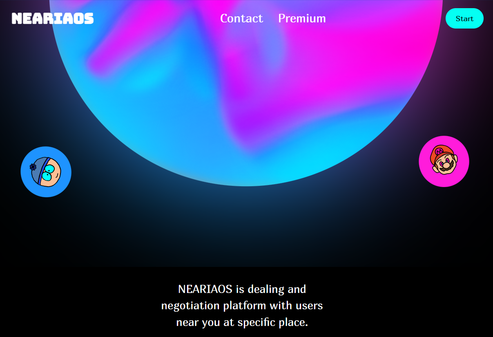
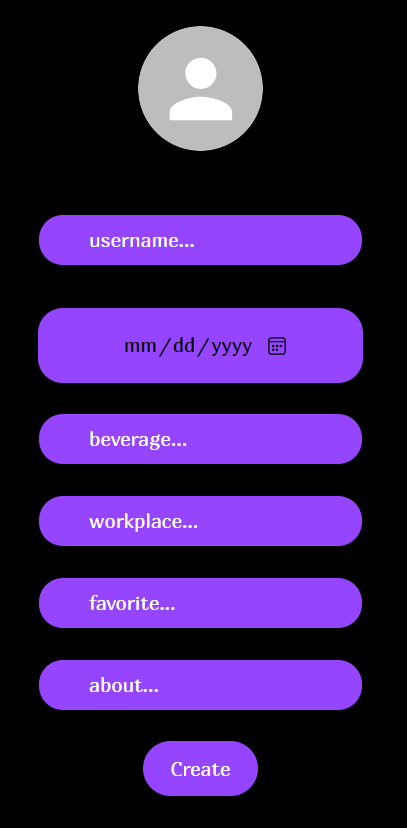
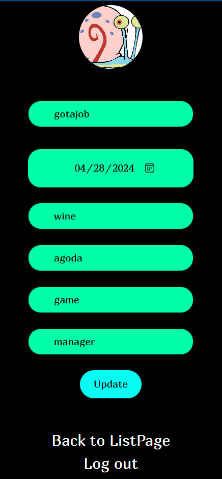
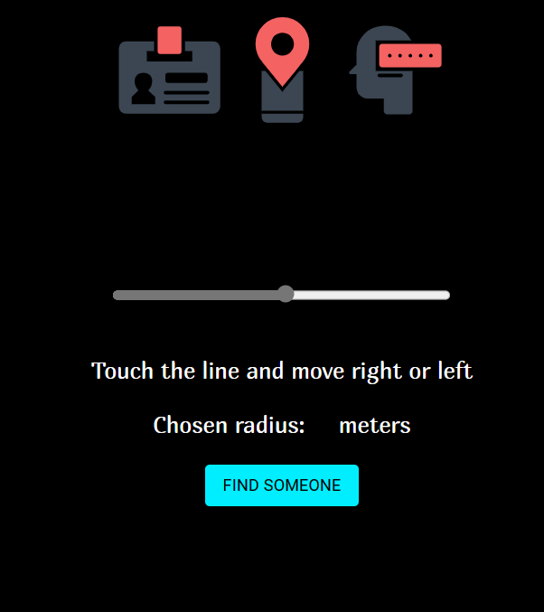
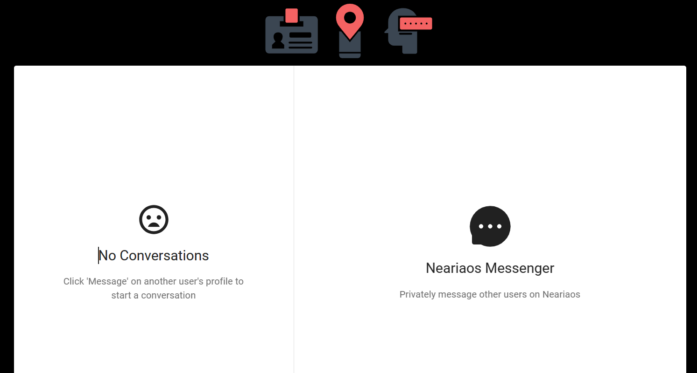

# NEARIAOS is dealing and negotiation platform with users near you at specific place.

## Features
1. Implement a LogIn and SignUp system using Firebase authentication with email verification.
2. Create a profile system that stores user data in a MongoDB database and image in Firebase storage.
3. Develop a chat system using Socket.io for real-time communication between client and server.
4. Create a searching system that utilizes geolocation for finding users within a specific range.
5. Implement Redux to facilitate the sending and displaying of data across the searching system, chat system, and profile system.
6. Implement Prometheus for collecting metrics, grafana for visualization, loki for logging and sentry.io for performance monitoring.
7. Create a contact form using react-hook-form for sending feedback about my platform or business contact.
8. Develop animations using Framer Motion for enhancing the user interface.
9. Create privacy policies using Termly.io for legal compliance.

### `npm start`

Runs the app in the development mode.\
Open [http://localhost:{your_endpoint}](http://localhost:{your_endpoint}) to view it in your browser.

The page will reload when you make changes.\
You may also see any lint errors in the console.

